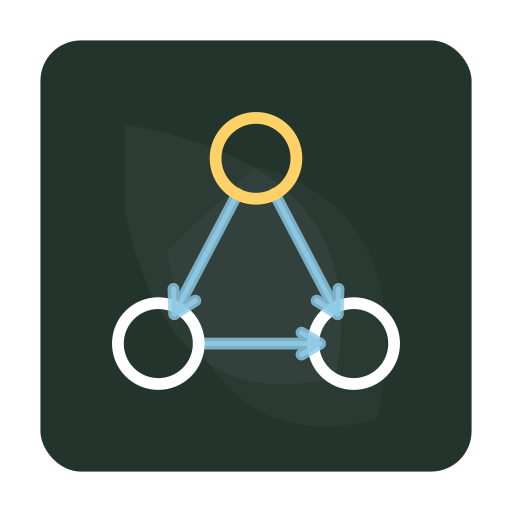

<p align="center">
  
</p>

<h1 align="center">blackboard</h1>

<p align="center">
  Local-first taskboard CLI for role-aware execution workflows.
</p>

`blackboard` is built for teams or agents that need:

- strict board-level permissions
- explicit task ownership boundaries
- validated task dependencies
- predictable local state in SQLite

No hosted service is required.

## What It Solves

Most task tools optimize for flexibility first. `blackboard` optimizes for controlled execution first:

- A board is the hard boundary of collaboration.
- Every action is permission-checked against board membership.
- Dependencies are validated at write-time, not left to convention.

This makes it a strong backend for:

- manager -> PM -> engineer execution loops
- custom multi-role workflows (planner, implementer, security, QA, release, etc.)
- multi-agent delivery with clear authority boundaries
- local automation pipelines that require deterministic task state

## Core Concepts

- `user`: actor identity passed with `--user`
- `board`: project scope boundary
- `task`: work item inside one board
- `permission`: explicit operation capability on a board
- `dependency`: task graph edge (`dependsOn`)

## Permission Model

Board owner has implicit full access.

Members have only explicitly granted permissions:

- `read`: board view, members view, task list/view
- `create`: task add
- `update`: task edit
- `delete`: task delete
- `set_status`: task status transitions
- `assign`: grant/revoke other members
- `delete_board`: board delete

`board list` includes boards you own and boards where you have `read`.

## Task Status Model

Valid statuses:

- `pending`
- `in_progress`
- `completed`
- `blocked`

Recommended operational meaning:

- `pending`: planned but not started
- `in_progress`: active execution
- `completed`: done and accepted
- `blocked`: waiting on dependency, decision, or permission

## Dependency Rules

Dependencies are enforced by the CLI:

- no self-dependency
- dependency target must be in the same board
- cycles are rejected

Set dependencies via `--depends-on "1,3,5"`.

Clear dependencies via:

- `--clear-depends-on`, or
- empty `--depends-on`

## Install

Global install:

```bash
cargo install --path .
```

Run from source without install:

```bash
cargo run -- --help
```

## Quick Start

```bash
# 1) Initialize first user (owner seed)
blackboard init --user manager

# 2) Add users
blackboard user add --user manager --name pm
blackboard user add --user manager --name engineer

# 3) Create a board
blackboard board create --user manager --name alpha

# 4) Grant role-specific permissions
blackboard board grant --user manager --board alpha --target pm --permissions read,create,update,delete
blackboard board grant --user manager --board alpha --target engineer --permissions read,set_status

# 5) Plan tasks as PM
blackboard task add --user pm --board alpha --title "Alpha: Analyze Scope" --description "Clarify requirements and constraints."
blackboard task add --user pm --board alpha --title "Alpha: Build Plan" --description "Break down delivery tasks."
blackboard task edit --user pm --board alpha --task-id 2 --depends-on "1"

# 6) Execute as engineer
blackboard task list --user engineer --board alpha
blackboard task status --user engineer --board alpha --task-id 1 --status in_progress
blackboard task status --user engineer --board alpha --task-id 1 --status completed
blackboard task status --user engineer --board alpha --task-id 2 --status in_progress
```

## Multi-Agent Workflow Helpers

This repository includes scripts for a baseline manager/PM/engineer setup:

```bash
BLACKBOARD_BIN=./target/debug/blackboard \
  ./skills/blackboard-agent-taskboard/scripts/bootstrap_project_board.sh manager alpha \
    pm:read,create,update,delete \
    engineer:read,set_status

BLACKBOARD_BIN=./target/debug/blackboard \
  ./skills/blackboard-agent-taskboard/scripts/seed_project_tasks.sh pm alpha Alpha
```

The bootstrap script creates users (if missing), creates the board, and applies role permissions.
The seed script adds a minimal planning baseline for PM refinement.
Role names are not fixed by `blackboard`; any role taxonomy can be modeled with `board grant` and least-privilege permissions.

## Command Reference

Global option:

```bash
--json
```

`--json` output contract:

- success: `{"ok":true,"lines":[...]}`
- failure: `{"ok":false,"error":"..."}`

### Init

```bash
blackboard init --user <user>
```

### Clear

Requires system root privileges (`euid=0`) to prevent accidental data loss:

```bash
sudo blackboard clear
```

### User

```bash
blackboard user add --user <actor> --name <user>
blackboard user remove --user <actor> --name <user>
blackboard user list --user <actor>
```

### Board

```bash
blackboard board create --user <actor> --name <board_name>
blackboard board list --user <actor>
blackboard board view --user <actor> --board <board_name_or_id>
blackboard board members --user <actor> --board <board_name_or_id>
blackboard board poll --user <actor> --board <board_name_or_id> [--interval <seconds>] [--idle-notice-secs <seconds>]
blackboard board grant --user <actor> --board <board_name_or_id> --target <user> [--permissions <read|create|update|delete|set_status|assign|delete_board,...>]
blackboard board revoke --user <actor> --board <board_name_or_id> --target <user>
blackboard board delete --user <actor> --board <board_name_or_id>
```

`board poll` defaults:

- `--interval 1`
- `--idle-notice-secs 30`

### Task

```bash
blackboard task list --user <actor> --board <board_name_or_id> [--status <pending|in_progress|completed|blocked>] [--parent <task_id>] [--assignee <user>]
blackboard task view --user <actor> --board <board_name_or_id> --task-id <task_id>
blackboard task add --user <actor> --board <board_name_or_id> --title <text> --description <text> [--parent <task_id>] [--assignee <user>] [--depends-on "1,3,5"]
blackboard task edit --user <actor> --board <board_name_or_id> --task-id <task_id> [--title <text>] [--description <text>] [--parent <task_id>] [--assignee <user>] [--depends-on "1,3,5"] [--clear-depends-on]
blackboard task status --user <actor> --board <board_name_or_id> --task-id <task_id> --status <pending|in_progress|completed|blocked>
blackboard task delete --user <actor> --board <board_name_or_id> --task-id <task_id>
```

## Operational Guidance

- Keep one project per board to avoid permission leakage and dependency confusion.
- Restrict planning mutations (`create`, `update`, `delete`) to planner roles.
- Use `set_status` for executor roles to preserve plan integrity.
- Prefer `--json` for automation and inter-agent handoff.

## Troubleshooting

- `forbidden` error:
  missing board permission for the action. Check with `board members`.
- dependency validation error:
  verify target task exists in same board and graph is acyclic.
- board/task not found:
  confirm actor has `read` and the board identifier is correct.

## Data Location

SQLite database file:

```text
~/.blackboard/blackboard.db
```

## Development

```bash
cargo fmt
cargo clippy --all-targets -- -D warnings
cargo test
cargo bench --no-run
cargo bench
```
